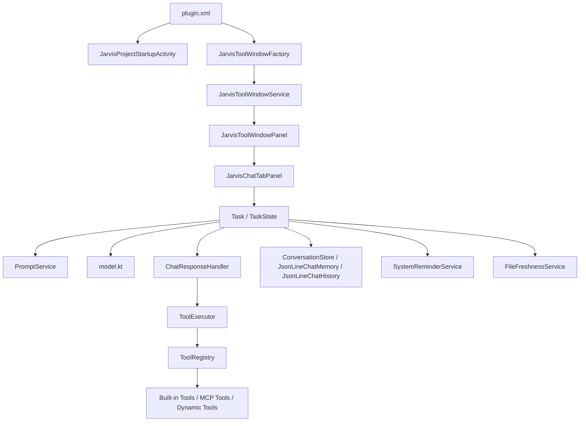

# ChatX Expert 项目文档

本目录用于沉淀 `chatx-expert` IntelliJ 插件的实现文档。文档以当前代码为准，重点覆盖架构分层、模块职责、核心流程、配置落盘和扩展开发方式。

## 文档地图

- [架构总览](architecture/overview.md)
- [核心流程](architecture/core-flows.md)
- [Agent 模块](modules/agent.md)
- [UI 模块](modules/ui.md)
- [Services 模块](modules/services.md)
- [存储与基础设施模块](modules/storage-and-infra.md)
- [扩展开发指南](extension/development-guide.md)

## 模块导航

| 目录/包 | 主要职责 | 关键类 | 对应文档 |
| --- | --- | --- | --- |
| `src/main/resources/META-INF`、`listener` | 插件注册、启动预热、生命周期挂载 | `plugin.xml`、`JarvisProjectStartupActivity` | [架构总览](architecture/overview.md) |
| `ui/core` | 工具窗、聊天面板、输入区、历史记录、消息渲染 | `JarvisToolWindowFactory`、`JarvisChatTabPanel` | [UI 模块](modules/ui.md) |
| `ui/settings` | 模型、MCP、智能体、Skills、Rules、自动审批配置 UI | `JarvisSettingsOverlayPanel`、`ModelsListPanel` | [UI 模块](modules/ui.md) |
| `agent`、`agent/tool`、`agent/parser`、`agent/mcp` | Agent 主循环、工具协议、流式解析、MCP 动态工具 | `Task`、`ToolExecutor`、`ToolRegistry`、`McpClientHub` | [Agent 模块](modules/agent.md) |
| `services` | 提示词装配、模型装配、系统提醒、文件新鲜度、加载服务 | `PromptService`、`AgentService`、`FileFreshnessService` | [Services 模块](modules/services.md) |
| `config` | IDE PersistentState 配置 | `JarvisCoreSettings`、`AgentSettings`、`AutoApproveSettings` | [存储与基础设施模块](modules/storage-and-infra.md) |
| `utils`、`external` | 会话存储、Todo/Checkpoint、Shell、文件/Git/RG 适配 | `ConversationStore`、`TodoStorage`、`CheckpointStorage`、`RipGrepUtil` | [存储与基础设施模块](modules/storage-and-infra.md) |

## 系统速览

## 当前实现的几个关键设计点

- 本地优先。模型列表、技能、智能体、MCP、会话历史和待办都保存在本地，不依赖外部平台服务。
- UI 与执行引擎解耦。`ui/*` 负责交互，`agent/*` 负责执行，二者通过 `Task` 和事件流连接。
- 会话采用双轨存储。`chat-memory-*.jsonl` 保存给模型的真实上下文，`chat-history.jsonl` 保存面向 UI 的渲染历史。
- 工具调用必须经过显式授权或自动审批策略。变更型工具还会配合 checkpoint 和文件新鲜度跟踪。
- 配置分层明确。应用级配置走 IntelliJ PersistentState，用户级/项目级 AI 资产走 `~/.jarvis` 和 `${project}/.jarvis`。

## 阅读顺序建议

1. 先看 [架构总览](architecture/overview.md)，建立总体心智模型。
2. 再看 [核心流程](architecture/core-flows.md)，理解聊天、工具调用、Plan 模式、配置刷新链路。
3. 之后按需深入各模块文档。
4. 需要开发新能力时直接跳到 [扩展开发指南](extension/development-guide.md)。

