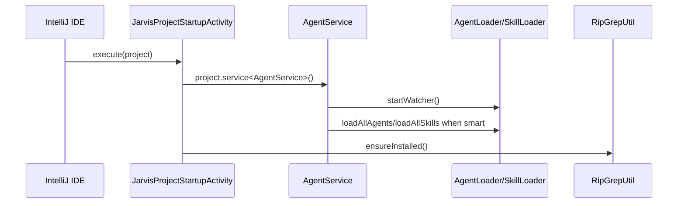
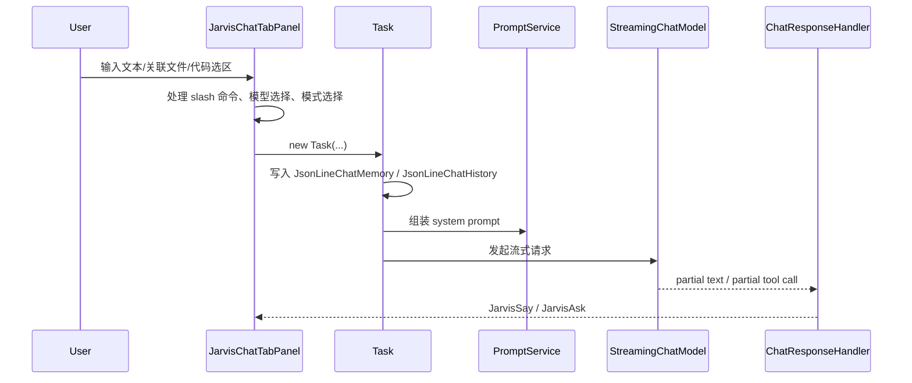
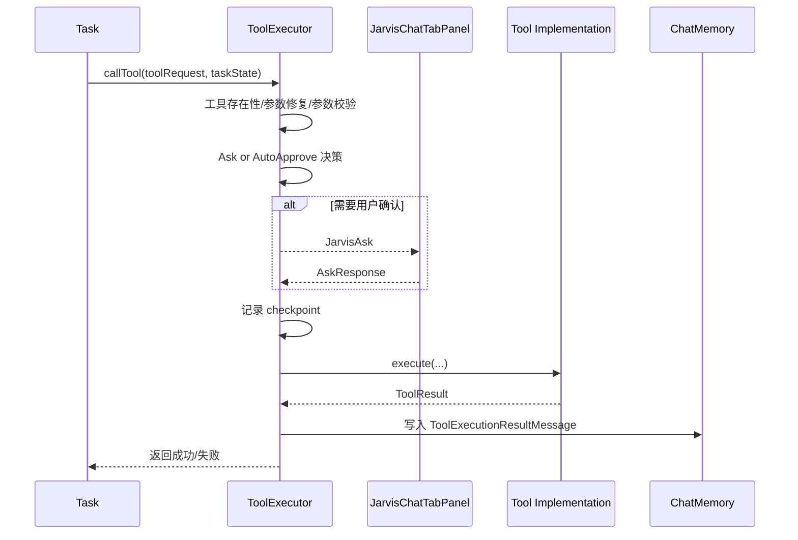

# 核心流程

本文档描述插件从启动到会话执行的主路径，以及与配置、Plan 模式、回滚相关的关键流程。

## 1. 项目启动流程

### 设计意图

- 把 AI 资产加载和 `rg` 预安装放在启动阶段，减少首次聊天时延。
- 把 watcher 放在 `AgentService` 中统一管理，而不是散落到各个 UI 面板里。

## 2. 打开工具窗与注入上下文

触发入口包括：

- 用户主动打开右侧 `Jarvis` 工具窗
- 编辑器右键 `Send Selection To Jarvis`
- 设置菜单动作打开某个设置 section

### 流程要点

1. `JarvisToolWindowFactory` 创建 `JarvisToolWindowPanel`。
2. `JarvisToolWindowService.bind(panel)` 把之前缓存的插入内容、关联文件、代码选区回放到当前 tab。
3. `AddToJarvisChatAction` 读取当前选区所在文件、行号和完整行文本，转成 `AssociatedCodeSelection`。
4. `JarvisToolWindowService` 保证即使工具窗还没显示，也不会丢失这次上下文注入。

## 3. 用户发起一轮聊天

### 发送前的关键处理

- `JarvisChatTabPanel` 会把顶部关联的代码选区拼接进最终提示文本。
- `/clear` 和 `/compact` 会在发请求前被截获，不进入模型调用流程。
- 如果当前没有选择模型，会弹出模型管理对话框。

### `Task` 初始化阶段做了什么

- 为新会话创建或更新 `conversation.json`
- 读取关联文件内容并写入 memory
- 为文件读取记录 `FileFreshnessService`
- 为主会话写入 `ChatHistoryUserMessage`
- 触发标题生成和链路观测

## 4. 模型流式响应与工具调用

### 4.1 纯文本响应

1. `ChatResponseHandler.onPartialResponse()` 累积文本片段。
2. `SseMessageParser` 把片段拆成 text/code/search-replace 等 segment。
3. UI 通过 `AssistantMessageCard` 和 `SegmentRendererFactory` 增量渲染。

### 4.2 工具调用响应

1. `onPartialToolCall()` 先把 partial arguments 交给 `ToolExecutor.handlePartialBlock()`。
2. 工具自身可以基于 partial 参数做预渲染，UI 会显示一个“将要执行”的工具卡片。
3. 完整 `AiMessage` 结束后，`Task.startTaskLoop()` 依次执行 tool requests。

## 5. 工具授权与执行流程

### 这里的关键设计

- 参数非法时，先修复或回写 tool error 给模型，而不是直接崩溃。
- 用户拒绝执行时，模型上下文里仍会收到 `tool denied` 结果，便于它继续调整策略。
- 变更型工具执行前会记录 checkpoint，给 UI 回滚功能提供基础。

## 6. Ask/Approve 交互流程

`JarvisChatTabPanel` 有三种输入状态：

- `IDLE`
- `RUNNING`
- `AWAITING_REPLY`

当工具调用或 `AskUserQuestion` 触发等待时：

1. `pendingAsk` 被设置。
2. `AskPanel` 进入可交互状态。
3. 用户可以选择同意、拒绝或附带反馈。
4. `AskResponse` 被回传给当前 `Task`。

这套机制统一承载了“工具授权”和“向用户追问”两类场景。

## 7. Plan 模式流程

### 7.1 直接进入 Plan 模式

- 用户在 UI 的模式下拉框中选择 `Plan`
- `PromptService.getSystemPrompt()` 追加只读规划约束
- `ToolRegistry.getPlanTools()` 限制可用工具集合
- `SystemReminderService` 注入只读提醒

### 7.2 从 Agent 模式进入嵌入式 Plan

系统还支持通过 `EnterPlanModeTool`/`ExitPlanModeTool` 在执行过程中切换。嵌入式 Plan 模式额外强调：

- 只能写会话 plan 目录
- 其余系统状态不允许变更
- 结束规划后必须显式退出

### 7.3 Plan 文件位置

计划文件目录由 `getPlanDirectory(project, convId)` 计算，位于会话目录下，而不是项目源码树里。

## 8. 会话命令流程

### 8.1 `/clear`

- UI 截获命令
- `ConversationCommandService.resetConversation()` 删除会话目录、清理 todo、重置缓存服务
- 当前聊天视图回到欢迎态

### 8.2 `/compact`

- `ConversationCommandService.compactConversation()` 读取当前 memory
- 调用 `forceCompact()` 生成压缩摘要
- 用摘要替换 memory，并在 history 中追加 `/compact` 和 assistant summary

这使“模型上下文压缩”与“用户可见历史”分离处理。

## 9. 设置与配置刷新流程

### 9.1 模型

- `ModelsListPanel` 直接读取和写入 `~/.jarvis/models.json`
- 修改成功后调用 `onModelsChanged`
- `JarvisToolWindowPanel.refreshModels()` 让各个 tab 更新下拉框

### 9.2 Skills / Agents

- UI 通过 `AgentService.skillLoader` / `agentLoader` 读取数据
- watcher 监听 `~/.jarvis` 和 `${project}/.jarvis`
- 文件变化后清缓存并刷新 UI

### 9.3 MCP

- `McpClientHub` 负责读取配置、连接服务器、维护状态和错误信息
- 启停/刷新会回写 `mcp_settings.json`
- 已连接的 MCP 工具会动态注入 `ToolRegistry`

## 10. 回滚流程

回滚依赖 `CheckpointStorage`：

1. 用户消息触发变更前，初始化 message checkpoint。
2. 写工具执行前记录相关文件快照。
3. UI 若触发回滚，则恢复文件快照和会话上下文快照。

这意味着回滚不只是“恢复文件内容”，还会把会话 memory/history 一并回退到对应时刻。

