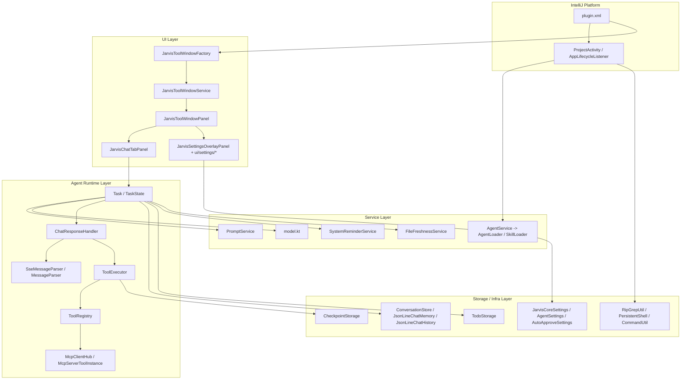

# 架构总览

## 1. 项目定位

`chatx-expert` 是一个面向 IntelliJ Platform 的本地 AI Agent 插件，当前聚焦于右侧 `Jarvis` 工具窗中的对话式开发能力。项目已经移除了登录、低代码、远程内网接口、编辑器补全等历史能力，主线功能集中在以下几类：

- 多轮 Agent 聊天与工具调用
- 本地模型配置与切换
- MCP 工具接入
- 本地 Agent / Skills / Rules 管理
- 自动审批与会话上下文管理

## 2. 运行时分层

## 3. 插件入口与启动方式

### 3.1 `plugin.xml`

插件入口定义在 `src/main/resources/META-INF/plugin.xml`，目前注册了三类能力：

- 工具窗：`JarvisToolWindowFactory`
- 项目启动任务：`JarvisProjectStartupActivity`
- 应用生命周期监听：`JarvisAppLifeListener`
- 编辑器右键动作：`AddToJarvisChatAction`

### 3.2 启动预热

`JarvisProjectStartupActivity` 在项目打开后做两件事：

- 预加载 `AgentService`，启动 Agent/Skill watcher
- 调用 `RipGrepUtil.ensureInstalled()`，准备内置 `rg` 二进制

这意味着搜索相关能力和本地 AI 资产管理，在第一次真正发起聊天前就已经准备好。

## 4. 核心对象之间的职责边界

### 4.1 `JarvisToolWindowService`

这是 UI 与外部动作之间的桥接层：

- 工具窗未初始化时，先缓存输入插入、关联文件、选区上下文
- 工具窗初始化后，再把缓存数据转发给当前 tab
- 负责从任意位置打开工具窗或切换到设置页

### 4.2 `JarvisChatTabPanel`

这是单个会话 tab 的主控制器，负责：

- 组合聊天列表、欢迎页、输入区、Ask 面板
- 把用户输入转成 `Task`
- 消费 `Task.startTaskLoop()` 的流式事件并渲染
- 处理 `/clear`、`/compact`、Ask/Approve 回复、回滚按钮等交互

### 4.3 `Task` / `TaskState`

`Task` 是一次会话请求的执行单元，`TaskState` 是其运行态上下文，承载：

- 当前会话 ID、消息 ID、模型 ID、模式
- 工具集合和 Ask future
- 会话 memory/history 存储
- 系统提醒服务、文件新鲜度服务、持久化 shell
- UI 事件回调 `emit`

一个关键设计是：`TaskState` 以 `taskId` 为键缓存 `SystemReminderService` 和 `FileFreshnessService`。这让同一个 tab 在多轮对话之间可以保留会话级提醒和文件状态，而不是每轮请求都完全重建。

### 4.4 `ChatResponseHandler`

它是模型流式输出的适配器，做三件事：

- 把普通文本分块解析成 segment，按节流策略推给 UI
- 把 tool call 的 partial arguments 交给 `ToolExecutor.handlePartialBlock()` 做实时渲染
- 在完整响应结束时组装最终 `AiMessage` 和 token usage 元数据

### 4.5 `ToolExecutor`

工具执行器承担了几乎所有“变更前校验”逻辑：

- 工具存在性校验
- 工具参数 JSON 修复与参数校验
- Ask / AutoApprove 授权决策
- 写操作 checkpoint 记录
- 工具执行、异常包装和 tool result 回写

这层设计把“工具函数本身”和“IDE/会话安全策略”解耦开了。

## 5. 配置与数据分层

### 5.1 应用级配置

走 IntelliJ PersistentState，面向整个 IDE 实例：

- `JarvisCoreSettings`
- `AgentSettings`
- `AutoApproveSettings`

### 5.2 用户级 AI 资产

默认位于 `~/.jarvis`：

- `models.json`
- `skills/**/SKILL.md`
- `agents/*.md`
- `mcp/mcp_settings.json`
- `intellij-chat-v2/<project>/<convId>/...`

### 5.3 项目级 AI 资产

位于项目根目录的 `.jarvis`：

- `.jarvis/skills/**/SKILL.md`
- `.jarvis/agents/*.md`
- `.jarvis/mcp/mcp_settings.json`

### 5.4 项目规则

项目规则由根目录的 `AGENTS.md` 承载，`RulesManagerPanel` 只是打开这个文件，不另造一套规则存储。

## 6. 会话数据结构

单个会话目录位于 `~/.jarvis/intellij-chat-v2/<project>/<convId>/`，典型内容包括：

- `conversation.json`：会话元数据
- `chat-history.jsonl`：UI 可渲染历史
- `chat-memory-<agentId>.jsonl`：模型真实上下文
- `todo-agent-<agentId>.json`：未完成 todo
- `checkpoint/<messageId>/...`：变更前快照

这里的设计非常关键：UI 历史和模型 memory 分离，使得压缩上下文、回滚、重放展示可以分别处理。

## 7. 设计思路总结

### 7.1 本地优先

大多数能力都通过本地文件、IDE state 和本地 shell 实现。这样做的好处是：

- 插件行为可预测
- 调试和排障不依赖平台服务
- 用户对模型、技能、智能体、MCP 的改动可以直接落地为文件

### 7.2 模式驱动

系统用 `ChatMode` 区分三种会话行为：

- `AGENT`：完整工具集
- `PLAN`：只读规划
- `ASK`：更偏问答解释

模式不仅影响 UI 文案，也直接影响工具集合和提醒策略。

### 7.3 显式授权

写文件、执行命令、调用敏感工具前，都要经过自动审批或 Ask 面板确认。这个约束贯穿 UI、工具协议、执行器和 checkpoint 机制。

### 7.4 配置热加载

Agent、Skill、MCP 都带 watcher。用户在磁盘上改文件后，不要求重启 IDE，运行态会重新加载并更新 UI。

## 8. 开发时要牢记的约束

- 新代码优先使用 Kotlin。
- 插件日志不要打印 `ERROR` 级别，否则可能触发 IDE 用户弹窗。
- 修改功能时要同时考虑 UI 渲染、会话持久化、工具授权和回滚链路，而不是只改单点逻辑。

